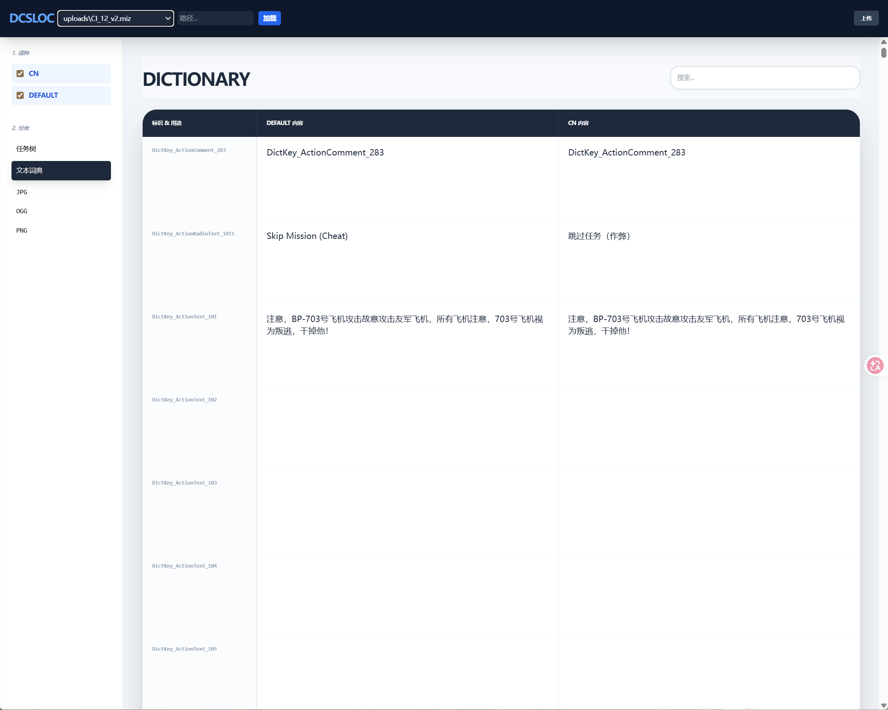
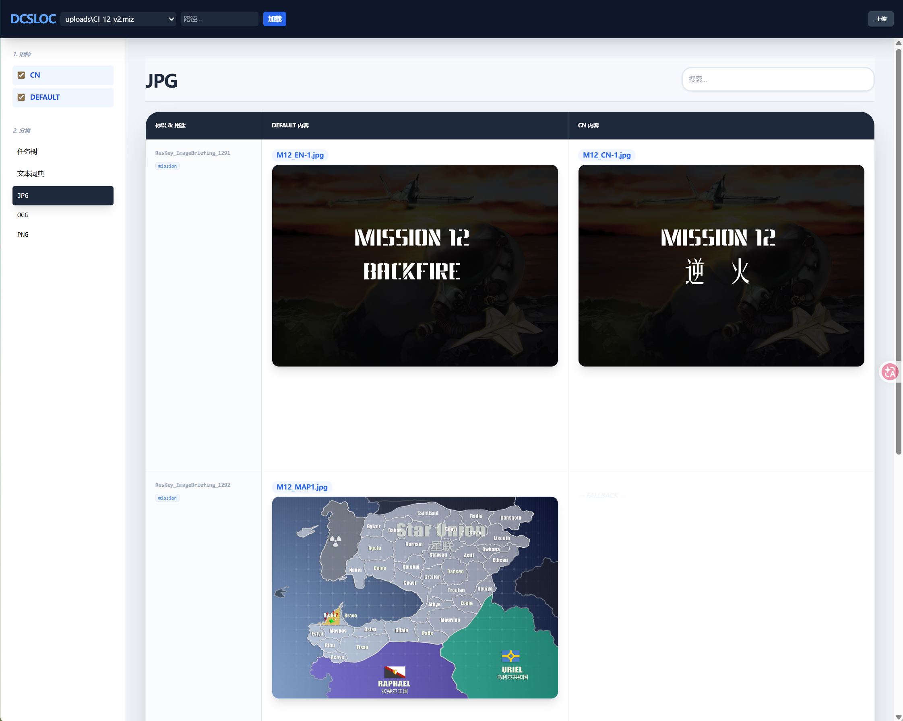
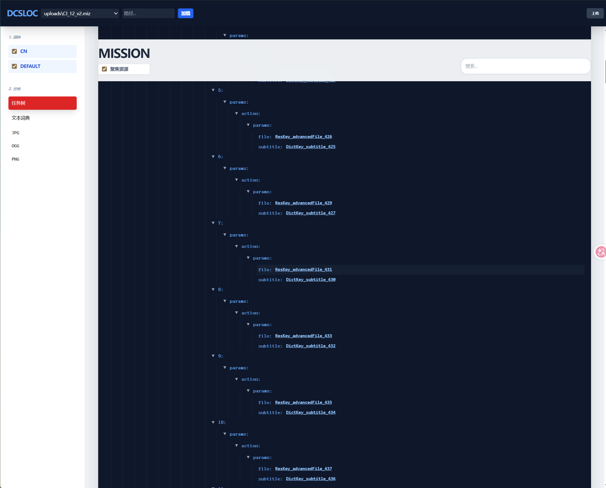
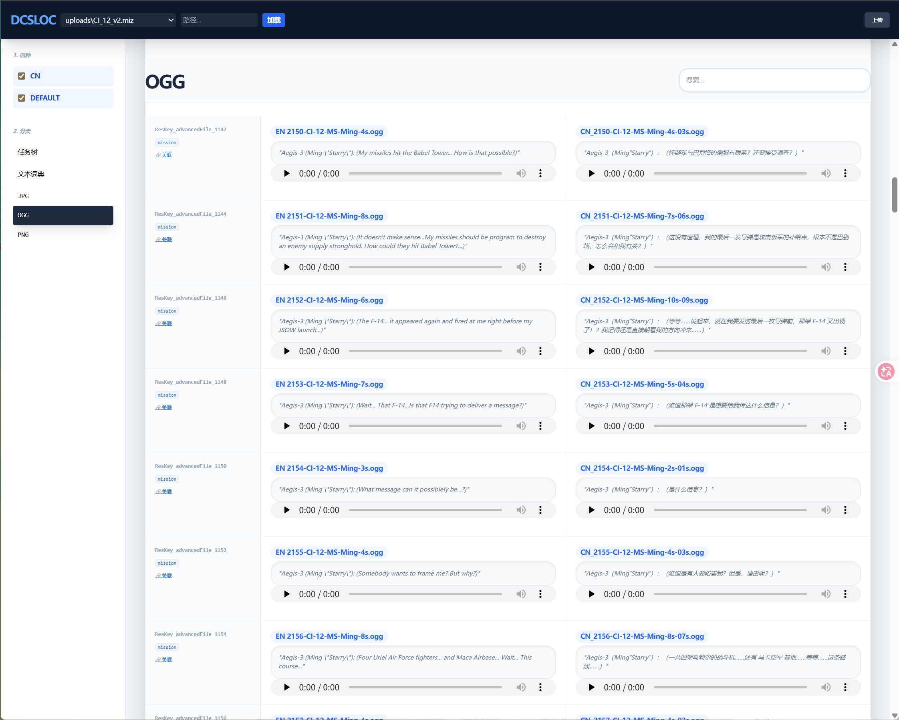

# DCS MIZ 本地化与逻辑探索工具 (DCSLOC)

> **背景简介**：[DCS World](https://www.digitalcombatsimulator.com/) (Digital Combat Simulator World) 是一款顶级的免费军事飞行模拟游戏。其任务文件（.miz 格式）包含了高度复杂的触发器逻辑、音频配音和多媒体简报。

这是一个专为 DCS 任务文件设计的高级本地化管理与逻辑分析工具。它能帮助你快速追加多语种支持，并深入探索任务触发逻辑与媒体资源的复杂关联。

## 🌟 核心特性

*   **可视化对照编辑**：并排对比不同语言的翻译，支持实时搜索。
*   **全包引用扫描**：自动扫描 MIZ 包内所有文件（mission, options, warehouses等），定位资源引用。
*   **智能任务树**：将复杂的 mission Lua 转换为可交互树状结构，支持“资源聚焦”过滤模式。
*   **双向关联跳转**：在文本台词与 OGG/PNG 资源之间一键跳转，支持实机用途标签显示。
*   **高性能架构**：采用虚拟列表（Virtual Scroll）技术，流畅处理包含数千资源的巨型任务。
*   **增量本地化**：仅打包有差异的内容，极大减小生成的 MIZ 体积。

## 📸 界面预览 (Screenshots)

| 文本与翻译对照 (Text Dictionary) | 多媒体资源关联 (Media Assets) |
| :---: | :---: |
|  |  |
| *高对比度界面，未翻译内容自动显示 Default 回退标记。* | *实时预览音频和图片，自动显示资源在实机中对应的台词文本。* |

| 任务逻辑树 (Mission Tree) | 全包引用扫描 (Global Reference) |
| :---: | :---: |
|  |  |
| *开启“聚焦资源”，过滤数千行无关代码，直击核心逻辑。* | *标识 Key 下方清晰展示该资源被哪些文件和触发器引用。* |

## 🚀 部署与运行

### 1. 环境准备
确保你的电脑已安装 [Python 3.8+](https://www.python.org/)。

### 2. 启动工具
*   **Windows 用户**：直接双击根目录下的 `start_tool.bat`。
*   **手动启动**：
    ```powershell
    pip install fastapi uvicorn python-multipart
    python app_server.py
    ```

### 3. 访问界面
在浏览器中打开：[http://127.0.0.1:8000](http://127.0.0.1:8000)

## 🛠 使用指南

### 加载任务
*   **快速选择**：下拉框会列出项目目录下的 MIZ 文件。
*   **自定义路径**：在顶部输入框粘贴电脑上任何位置的 MIZ 绝对路径并点击“加载”。
*   **直接上传**：点击右上角“上传”处理新的任务文件。

### 本地化工作流
1.  **翻译文本**：在“文本词典”分类下，对比 `DEFAULT` 和 `CN` 的差异。
2.  **核对配音**：切换到 `.ogg` 分类，点击播放器听取语音，上方会自动显示对应的台词。
3.  **分析逻辑**：进入“任务树”视图，开启“聚焦资源”，点击 DictKey 链接可瞬间跳回翻译界面。

## 📂 项目结构
*   `app_server.py`: Web 后端服务入口。
*   `index.html`: 高性能单页面前端。
*   `miz_lib.py`: 核心解析库。
*   `miz_localizer.py`: 命令行增量打包工具。
*   `miz_browser.py`: 命令行预览工具。

## ⚠️ 版权注意
本项目已通过 `.gitignore` 配置，**严禁上传任何原始或修改后的 .miz 任务文件到 GitHub**，以保护原创作者的知识产权。
